# Code Experiments

This repository contains various small code trials and experiments. It serves as a collection of different coding projects and demonstrations.

## Current Projects

- <a href="https://kavierim.github.io/temp/FluidSimulation.html">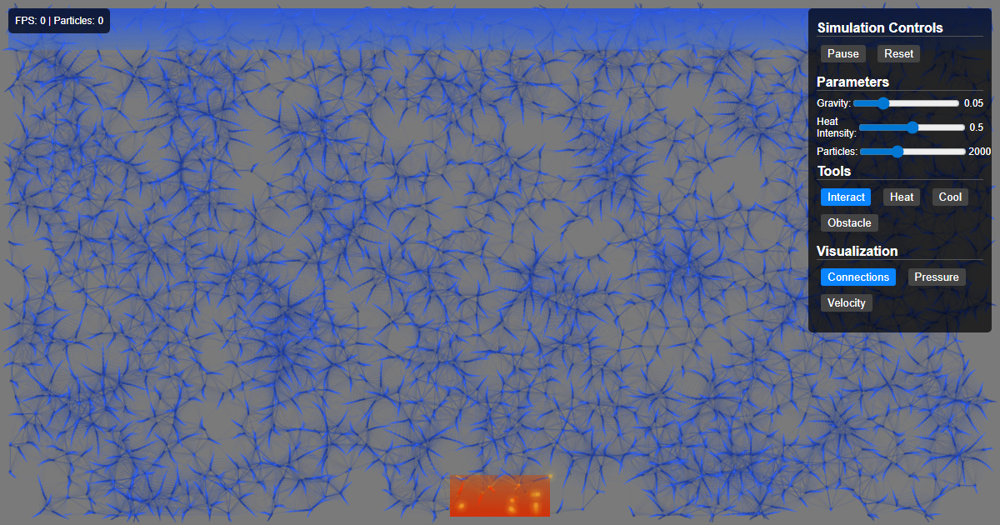</a><br>
  **[Fluid Simulation](https://kavierim.github.io/temp/FluidSimulation.html)**: An interactive fluid dynamics simulator in HTML/JavaScript


- <a href="https://kavierim.github.io/temp/PyScript.html">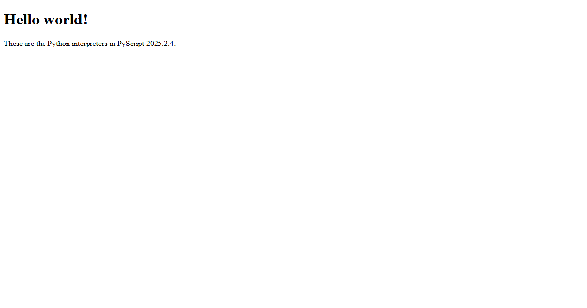</a><br>
  **[PyScript Example](https://kavierim.github.io/temp/PyScript.html)**: A demonstration of running Python in the browser using PyScript


- <a href="https://kavierim.github.io/temp/maastokartta.html">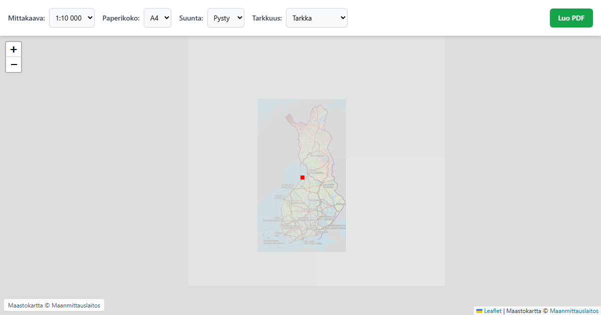</a><br>
  **[Maastokartta](https://kavierim.github.io/temp/maastokartta.html)**: A topographic map visualization project


- <a href="https://kavierim.github.io/temp/VideoLooper.html"></a><br>
  **[Video-Audio Loop-Merger](https://kavierim.github.io/temp/VideoLooper.html)**: Loop a video for the full duration of an audio track. Runs 100% in your browser.


- <a href="https://kavierim.github.io/temp/Motion_Magnifier.html">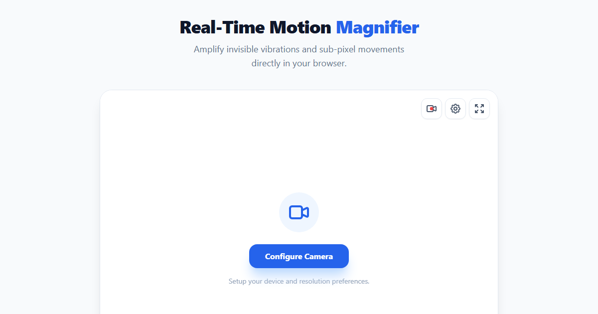</a><br>
  **[Motion Magnifier](https://kavierim.github.io/temp/Motion_Magnifier.html)**: Real-time webcam motion magnification tool (Eulerian Video Magnification) that amplifies sub-pixel movements and vibrations in the browser.


- <a href="https://kavierim.github.io/temp/LastFrameExtractor.html">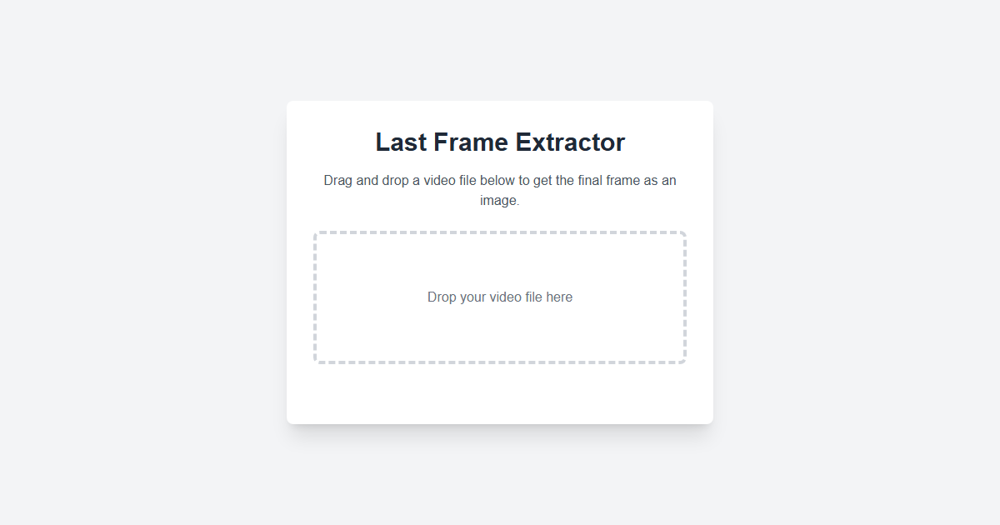</a><br>
  **[Last Frame Extractor](https://kavierim.github.io/temp/LastFrameExtractor.html)**: Extract the last frame of a video as an image. Runs 100% in your browser.


- <a href="https://kavierim.github.io/temp/Chatbot.html">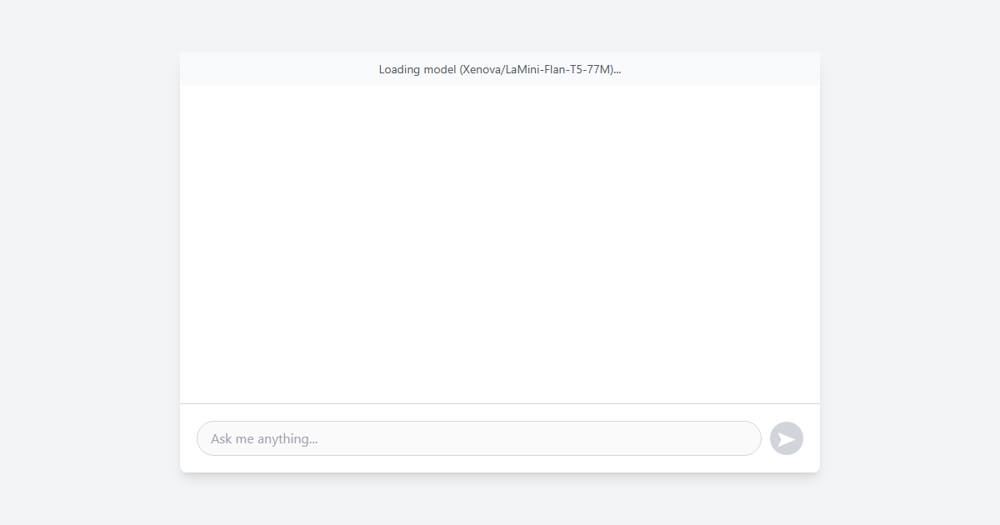</a><br>
  **[Chatbot](https://kavierim.github.io/temp/Chatbot.html)**: A browser-based chatbot using Transformers.js.


- <a href="https://kavierim.github.io/temp/Image2HTML.html">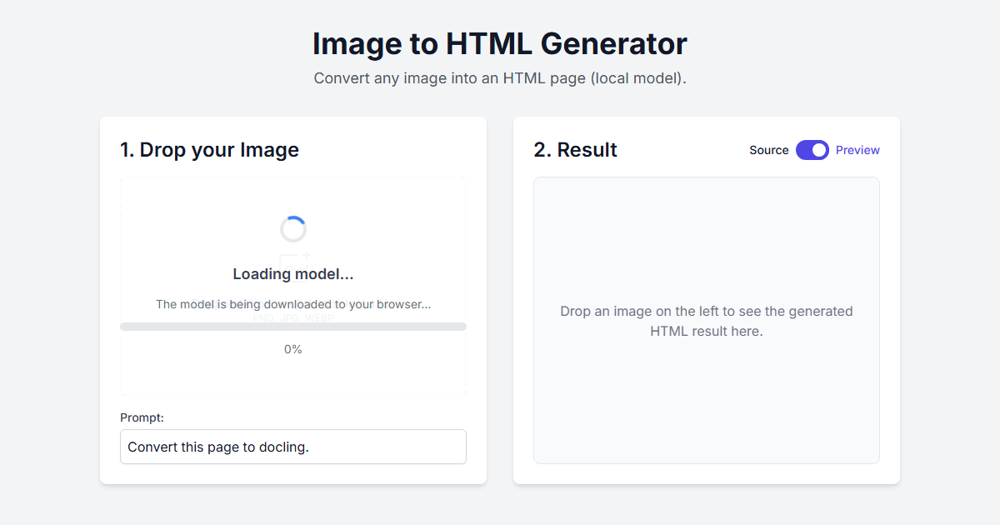</a><br>
  **[Image to HTML Generator](https://kavierim.github.io/temp/Image2HTML.html)**: Convert an image into an HTML page using a local model. Runs 100% in your browser.


- <a href="https://kavierim.github.io/temp/TextToSpeech.html">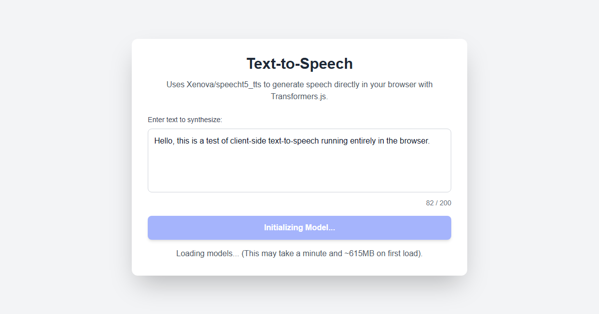</a><br>
  **[Text to Speech](https://kavierim.github.io/temp/TextToSpeech.html)**: Generate speech from text directly in your browser using Transformers.js.


- <a href="https://kavierim.github.io/temp/Viikkokalenteri.html">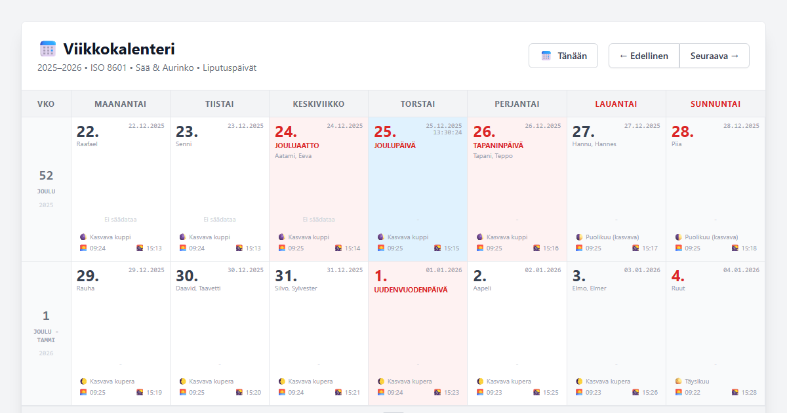</a><br>
  **[Viikkokalenteri](https://kavierim.github.io/temp/Viikkokalenteri.html)**: A Finnish weekly calendar with name days, holidays, and weather information.


- <a href="https://kavierim.github.io/temp/PDFConverter.html">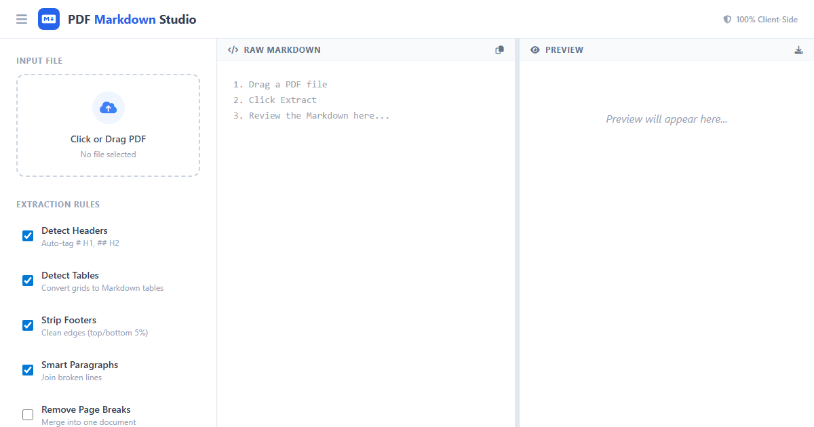</a><br>
  **[PDF Converter](https://kavierim.github.io/temp/PDFConverter.html)**: Local PDF to Markdown/LaTeX converter (client-side, no uploads).


- <a href="https://kavierim.github.io/temp/Background_Remove.html">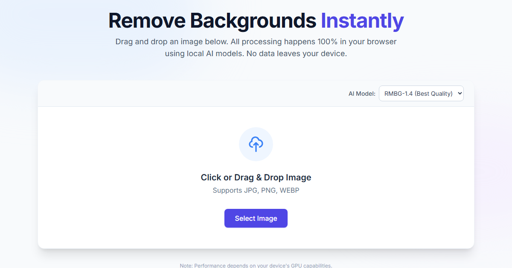</a><br>
  **[Background Remove](https://kavierim.github.io/temp/Background_Remove.html)**: Remove the background from an image. Runs 100% in your browser.


- <a href="https://kavierim.github.io/temp/pyscript_hello.py"></a><br>
  **[Pyscript Hello](https://kavierim.github.io/temp/pyscript_hello.py)**: A "hello world" example for PyScript.


- <a href="https://kavierim.github.io/temp/QR_Code_Generator.html">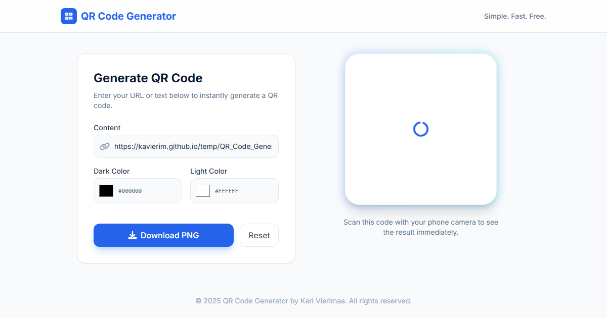</a><br>
  **[QR Code Generator](https://kavierim.github.io/temp/QR_Code_Generator.html)**: Generate free, custom QR codes instantly.


## How to Use

All HTML files in this repository are accessible via GitHub Pages. You can access them using the following URL pattern:

```
https://kavierim.github.io/temp/[filename].html
```

For example:

- https://kavierim.github.io/temp/Viikkokalenteri.html

## Contributing

Feel free to fork this repository and experiment with the code. Pull requests for improvements or new experiments are welcome!

## License

This project is licensed under the MIT License - see below for details:

```
MIT License

Copyright (c) 2025

Permission is hereby granted, free of charge, to any person obtaining a copy
of this software and associated documentation files (the "Software"), to deal
in the Software without restriction, including without limitation the rights
to use, copy, modify, merge, publish, distribute, sublicense, and/or sell
copies of the Software, and to permit persons to whom the Software is
furnished to do so, subject to the following conditions:

The above copyright notice and this permission notice shall be included in all
copies or substantial portions of the Software.

THE SOFTWARE IS PROVIDED "AS IS", WITHOUT WARRANTY OF ANY KIND, EXPRESS OR
IMPLIED, INCLUDING BUT NOT LIMITED TO THE WARRANTIES OF MERCHANTABILITY,
FITNESS FOR A PARTICULAR PURPOSE AND NONINFRINGEMENT. IN NO EVENT SHALL THE
AUTHORS OR COPYRIGHT HOLDERS BE LIABLE FOR ANY CLAIM, DAMAGES OR OTHER
LIABILITY, WHETHER IN AN ACTION OF CONTRACT, TORT OR OTHERWISE, ARISING FROM,
OUT OF OR IN CONNECTION WITH THE SOFTWARE OR THE USE OR OTHER DEALINGS IN THE
SOFTWARE.
```

Happy hacking!